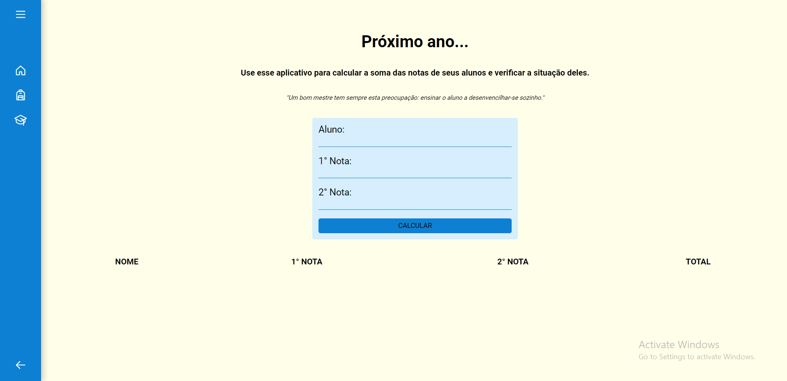

<h1 align="center"> Sua Nota 📚 </h1>

    Calcule a nota do aluno e vejo a sua situação.

 

  <a href="#-status">Status</a>&nbsp;&nbsp;&nbsp;|&nbsp;&nbsp;&nbsp;
  <a href="#-tecnologias">Tecnologias</a>&nbsp;&nbsp;&nbsp;|&nbsp;&nbsp;&nbsp;
  <a href="#-projeto">Projeto</a>&nbsp;&nbsp;&nbsp;|&nbsp;&nbsp;&nbsp;
  <a href="#-licença">Licença</a>&nbsp;&nbsp;&nbsp;|&nbsp;&nbsp;&nbsp;
  <a href="#-contato">Contato</a>

  

 

  

## 🚧 Status

Trabalhando nisso...

## 🚀 Tecnologias

Esse projeto foi desenvolvido com as seguintes tecnologias:

- HTML & CSS
- JavaScript
- Git & Github
- Figma

## 💻 Projeto

  O projeto foi montado a partir de um exercício do livro Lógica de Programação e Algoritmos com JavaScript que seria somente o cálculo da nota do aluno e me deu a ideia de montar um projeto mais estruturado. 

  A ideia do projeto seria de montar uma tabela com o nome do aluno, a primera e a segunda nota e o valor total da média das duas. O professor cadastra o nome do aluno e suas notas a serem calculadas.

  Você pode acessar o projeto online através [desse link](https://vagner-jr.github.io/your-score/).

## 📄 Licença

Esse projeto está sob a licença MIT.

---

<h2 align="center">📱Contato</h2> 

